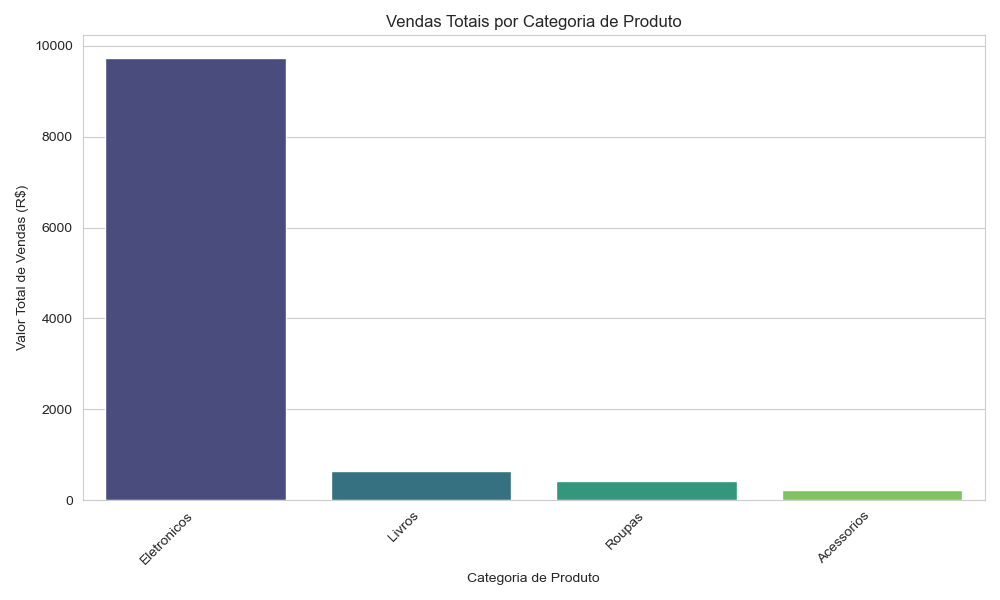
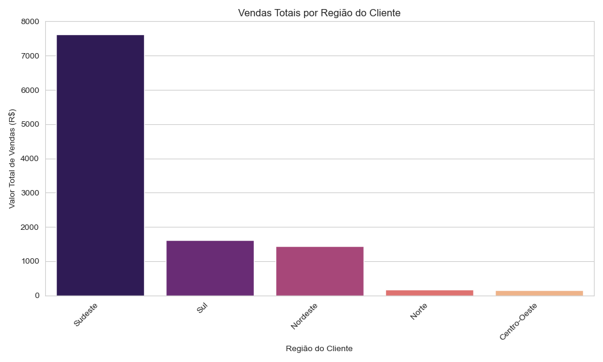
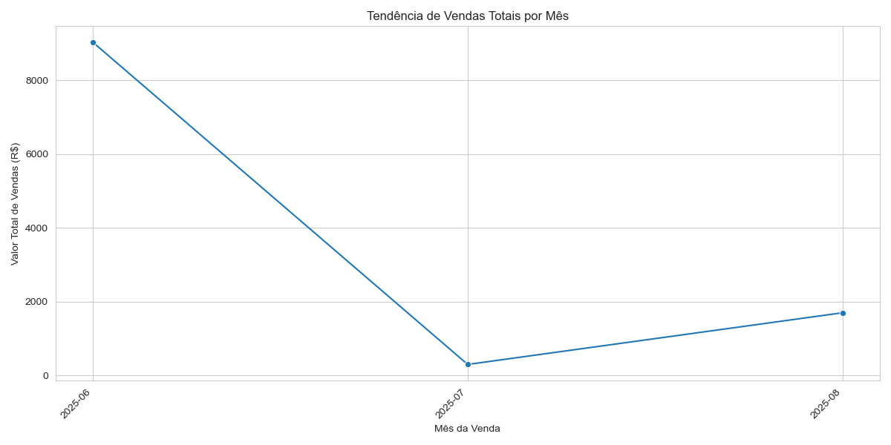

# 📊 Sistema de Análise e Geração de Relatórios de E-commerce

---

## 💡 Visão Geral do Projeto

Este projeto em **Python** apresenta uma solução robusta e modular para a **análise e geração automatizada de relatórios visuais** a partir de dados de vendas de um e-commerce. Desenvolvido com foco em **Programação Orientada a Objetos (POO)**, o sistema demonstra a integração de bibliotecas essenciais de Data Science para cobrir um **pipeline completo**: da ingestão e processamento de dados, passando pela análise e persistência, até a visualização e exportação de insights.

O objetivo principal é transformar dados brutos de transações em **informações acionáveis**, permitindo uma compreensão clara do desempenho de vendas por diferentes dimensões (ex: categoria de produto, região do cliente e tendências temporais).

---

## 🎯 Objetivos e Funcionalidades Chave

### 📥 Carregamento e Pré-processamento de Dados

* **Fonte de Dados:** Ingestão de dados de vendas simulados a partir de um arquivo **CSV**.
* **Transformações com Pandas:** Normalização de dados, conversão de tipos (ex: datas para formato `datetime`), e cálculo de métricas essenciais, como o `Valor_Total_Venda` para cada transação.

### 🔍 Análise Exploratória e Agrupamentos

* Utilização extensiva da biblioteca **Pandas** para realizar agrupamentos e agregações.
* Geração de resumos de vendas por **`Categoria_Produto`**, **`Regiao_Cliente`** e **`Mes_Venda`**, revelando padrões e as áreas de maior e menor desempenho.

### 📈 Visualização de Dados

* Implementação de gráficos claros e intuitivos usando **Matplotlib** e **Seaborn**.
* **Visualizações incluem:**
    * **Gráfico de Barras** para vendas totais por categoria de produto.
    * **Gráfico de Barras** para vendas totais por região do cliente.
    * **Gráfico de Linhas** para a tendência de vendas ao longo do tempo (por mês), mostrando flutuações e progressão.

### 🗄️ Persistência de Dados (SQLite)

* Integração com um banco de dados **SQLite3** para armazenamento persistente dos dados processados.
* O projeto demonstra a criação de tabelas, **inserção de DataFrames Pandas em tabelas SQL (`df.to_sql()`)** e a **recuperação de dados do banco de dados para análise (`pd.read_sql_query()`)**, simulando um fluxo de dados de um sistema real.

### 🏗️ Arquitetura Orientada a Objetos (POO)

* O código foi **refatorado e estruturado em classes bem definidas** para promover a modularidade, reusabilidade e manutenibilidade.
* **`DataManager`:** Gerencia o carregamento, pré-processamento e acesso aos dados de vendas.
* **`DatabaseManager`:** Abstrai as operações de conexão, criação de tabelas, inserção e consulta de dados no SQLite.
* Essa **separação de responsabilidades** torna o projeto escalável e fácil de entender.

### 📤 Exportação de Relatórios

* Os gráficos gerados são automaticamente salvos como arquivos de imagem **PNG** em um diretório dedicado (`relatorios_imagens/`). Isso facilita o **compartilhamento dos insights** com *stakeholders* que não precisam executar o código.

---

## 🛠️ Tecnologias e Ferramentas

* **Python 3.x**
* **Pandas:** Manipulação e análise de dados.
* **Matplotlib & Seaborn:** Criação de visualizações de dados.
* **SQLite3:** Banco de dados relacional para persistência.
* **Jupyter Notebook:** Utilizado para documentação detalhada e explicação linha a linha do código (como um guia interativo do projeto).

---

## 📖 Análise Detalhada e Explicação do Código

Para uma compreensão aprofundada de cada etapa do projeto, incluindo as transformações de dados, lógica das classes e visualizações, consulte o notebook Jupyter dedicado:

[Acessar Notebook de Explicação Detalhada](Analise_E-commerce_Explicada.ipynb)

---

## 🎓 Resultados e Aprendizados

Este projeto serviu como uma **experiência prática e aprofundada** em um pipeline de Data Science. Através dele, foram consolidados conhecimentos em:

* Limpeza e transformação de dados.
* Extração de insights a partir de dados brutos.
* Comunicação de resultados através de visualizações eficazes.
* Interação com sistemas de banco de dados.
* Aplicação de princípios de **POO** para desenvolver código organizado e de fácil manutenção.

---

## 📂 Estrutura do Projeto

├── vendas.csv ------------ # Dados de vendas simulados

├── ecommerce_data.db ------------ # Banco de dados SQLite gerado pelo script

├── relatorios_imagens/ ------------ # Diretório onde os gráficos PNG são salvos

│   ├── vendas_por_categoria.png

│   ├── vendas_por_mes.png

│   └── vendas_por_regiao.png

└── main.py ------------ # Script principal do projeto

---

## 📈 Exemplos de Relatórios Gerados

Aqui estão alguns exemplos dos gráficos que o projeto gera:

### Vendas Totais por Categoria de Produto

### Vendas Totais por Região do Cliente

### Tendência de Vendas Totais por Mês

---

## ✉️ Contato

* **Guilherme Rodrigues** - [Guilherme Rodrigues](https://www.linkedin.com/in/guilhrodrigues/)
* **Guilh-Code** - [https://github.com/Guilh-Code](https://github.com/Guilh-Code)
